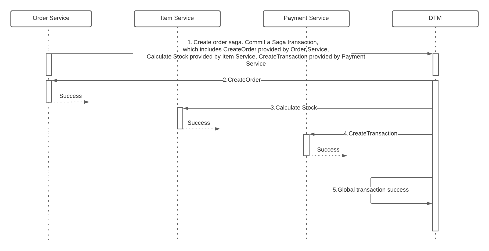

# Golang Sage Pattern with DTM
Orchestration saga example with docker compose, golang and dtm
## What is DTM

DTM is a distributed transaction framework which provides cross-service eventual data consistency. It provides saga, tcc, xa, 2-phase message, outbox, workflow patterns for a variety of application scenarios.

## Architecture

